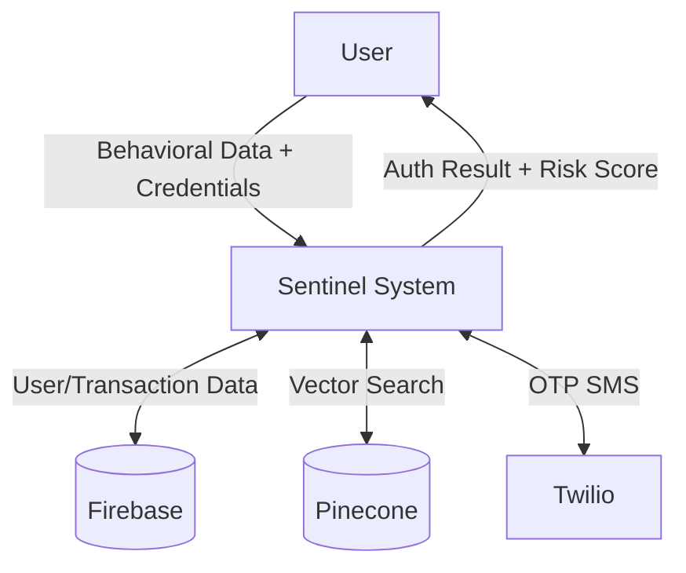
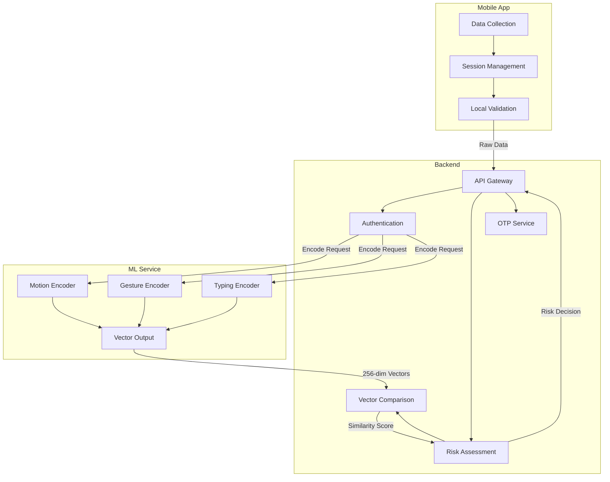
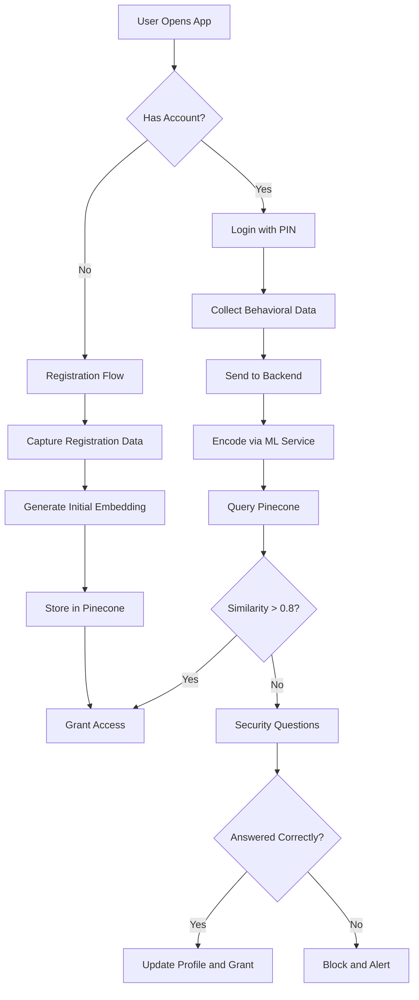
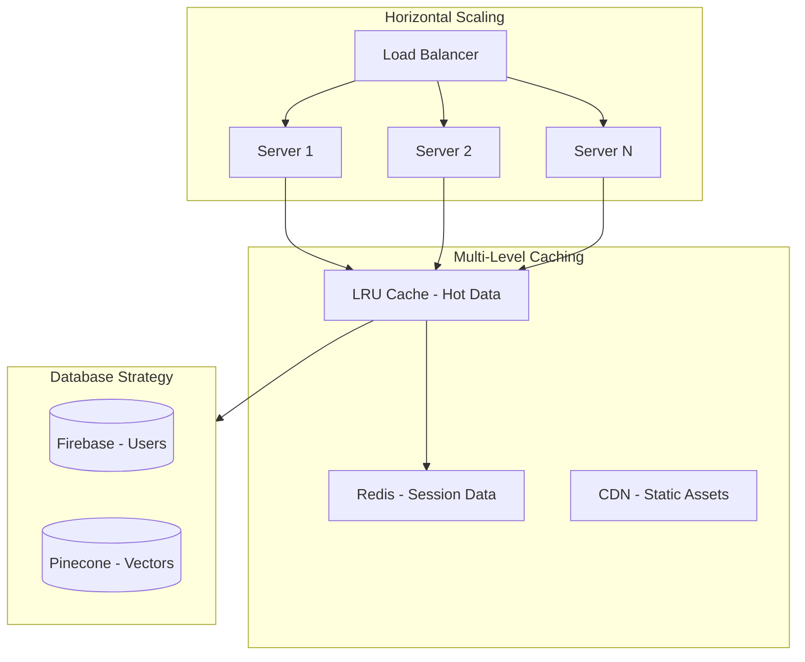

<p align="center">
  
  
  
</p>

<p align="center">
  
  
  
</p>

# Sentinel - Behavioral Biometrics Authentication for Banking

> **Round 2 Submission** - A complete, functional fraud detection system that creates a unique "digital fingerprint" from your typing, touch, and motion patterns. Even if hackers steal your credentials, they can't replicate your behavior.

---

## Table of Contents

1. [Problem Statement](#problem-statement)
2. [Solution Overview](#solution-overview)
3. [Technical Deep Dive](#technical-deep-dive)
4. [System Architecture](#system-architecture)
5. [Data Flow Diagrams](#data-flow-diagrams)
6. [Database Schema](#database-schema)
7. [Repository Structure](#repository-structure)
8. [Scalability and Fault Tolerance](#scalability-and-fault-tolerance)
9. [Team and Contributions](#team-and-contributions)
10. [Tech Stack](#tech-stack)
11. [Installation and Setup](#installation-and-setup)
12. [API Documentation](#api-documentation)
13. [Demo Videos](#demo-videos)

---

## Problem Statement

### The Scale of Banking Fraud in India

According to RBI and industry reports:

| Statistic | Value | Source |
|-----------|-------|--------|
| Digital payment fraud cases (2022-23) | **14,483 cases** | RBI Annual Report |
| Total amount lost to UPI fraud | **Rs 2,145 crore** | NPCI Data |
| OTP-based authentication bypassed | **67% of fraud cases** | PwC India Study |
| Account takeover attacks growth | **+250% YoY** | Juniper Research |

### Why Traditional Authentication Fails

Digital banking faces three critical attack vectors:

| Attack Vector | How It Works | Why OTP/PIN Fails |
|---------------|--------------|-------------------|
| **SIM Swap Fraud** | Attackers convince telecom to transfer victim's number | OTPs are intercepted directly |
| **Phishing + Social Engineering** | Fake bank pages/calls trick users into sharing credentials | Credentials work for anyone who has them |
| **Malware + Screen Recording** | Keyloggers capture PINs as users type | PIN patterns are easily replayable |

**The Fundamental Gap**: Traditional authentication verifies *what you know* (password) or *what you have* (OTP), but NOT *who you are*. Stolen credentials are indistinguishable from legitimate ones.

### Our Hypothesis

> "Every person has unique behavioral patterns - how they type, how they hold their phone, how they swipe. These patterns are nearly impossible to replicate, even if attackers have the credentials."

This is supported by academic research:
- Killourhy & Maxion (2009): Keystroke dynamics achieve 96% accuracy in user identification
- Feng et al. (2012): Touch dynamics on mobile devices can identify users with 99.4% accuracy
- Shi et al. (2011): Motion sensor data provides unique device handling signatures

---

## Solution Overview

**Sentinel** introduces behavior-based authentication that works even when credentials are compromised:

```
Traditional: Password/PIN --> Access Granted (Anyone with credentials)
Sentinel:    Password/PIN + Behavior Match --> Access Granted (Only the real user)
```

### Core Innovation

We analyze three behavioral modalities that are unique to each user:

| Modality | What We Capture | ML Model | Features Extracted |
|----------|-----------------|----------|-------------------|
| **Typing Dynamics** | Keystroke timing, dwell time, flight time | Bidirectional LSTM | Character embedding, timing vectors, coordinate positions |
| **Touch Patterns** | Swipe velocity, pressure, gesture patterns | LSTM Autoencoder | Touch area, pressure curves, velocity profiles |
| **Motion Behavior** | Device handling, orientation, accelerometer | LSTM Autoencoder | 3-axis acceleration, gyroscope rotation, gravity vectors |

Each modality produces a **256-dimensional vector embedding** that serves as the user's behavioral fingerprint.

---

## Technical Deep Dive

### ML Model Architecture

```python
# Bidirectional LSTM Encoder for Keystroke Dynamics
class KeystrokeEncoder(nn.Module):
    def __init__(self, vocab_size=128, embed_dim=64, hidden_dim=256):
        super().__init__()
        self.char_embedding = nn.Embedding(vocab_size, embed_dim)
        self.lstm = nn.LSTM(
            input_size=embed_dim + 4,  # char embed + [dwell, flight, x, y]
            hidden_size=hidden_dim,
            num_layers=2,
            bidirectional=True,
            batch_first=True,
            dropout=0.3
        )
        self.fc = nn.Sequential(
            nn.Linear(hidden_dim * 2, 512),
            nn.ReLU(),
            nn.Dropout(0.2),
            nn.Linear(512, 256)  # Output: 256-dim embedding
        )
    
    def forward(self, chars, timing_features):
        char_embeds = self.char_embedding(chars)
        combined = torch.cat([char_embeds, timing_features], dim=-1)
        lstm_out, (h_n, _) = self.lstm(combined)
        h_concat = torch.cat([h_n[-2], h_n[-1]], dim=-1)
        return F.normalize(self.fc(h_concat), dim=-1)
```

### Risk Scoring Algorithm

The comprehensive risk assessment combines multiple factors:

```javascript
// Risk Score Calculation (0-100 scale)
function calculateRiskScore(behavioralSimilarity, locationData, deviceData) {
  let riskScore = 0;
  
  // Behavioral similarity (40% weight)
  if (behavioralSimilarity < 0.5) riskScore += 40;
  else if (behavioralSimilarity < 0.7) riskScore += 25;
  else if (behavioralSimilarity < 0.85) riskScore += 10;
  
  // Location factors (25% weight)
  if (locationData.vpnDetected) riskScore += 15;
  if (locationData.impossibleTravel) riskScore += 25;
  if (locationData.newLocation) riskScore += 10;
  
  // Device factors (20% weight)
  if (deviceData.newDevice) riskScore += 15;
  if (deviceData.rooted || deviceData.jailbroken) riskScore += 20;
  
  // Network factors (15% weight)
  if (networkData.simChanged) riskScore += 15;
  if (networkData.proxyDetected) riskScore += 10;
  
  return Math.min(riskScore, 100);
}
```

### Vector Similarity Matching

We use cosine similarity to compare behavioral embeddings:

```
Similarity = (Current_Embedding · Stored_Embedding) / (||Current|| × ||Stored||)

Decision Logic:
- Similarity > 0.85 --> LOW RISK --> Allow Transaction
- Similarity 0.70-0.85 --> MEDIUM RISK --> Require Security Questions
- Similarity < 0.70 --> HIGH RISK --> Block + Alert
```

### VPN and Fraud Detection

```javascript
// Impossible travel detection
function detectImpossibleTravel(currentLocation, lastLocation, timeDelta) {
  const distance = haversineDistance(currentLocation, lastLocation);
  const velocity = distance / (timeDelta / 3600000); // km/h
  
  // Commercial aircraft max speed ~900 km/h
  // Anything faster indicates VPN/location spoofing
  return velocity > 1000;
}
```

---

## System Architecture

```
+-----------------------------------------------------------------------------+
|                           SENTINEL ARCHITECTURE                              |
+-----------------------------------------------------------------------------+
|                                                                              |
|  +------------------+    +------------------+    +----------------------+    |
|  |   MOBILE APP     |    |     BACKEND      |    |   ML SERVICES        |    |
|  |   (React Native) |<-->|  (Node.js)       |<-->|   (Python/Flask)     |    |
|  |                  |    |                  |    |                      |    |
|  |  - Data Capture  |    |  - API Gateway   |    |  - Keystroke Encoder |    |
|  |  - Touch Events  |    |  - Auth Logic    |    |  - Touch Encoder     |    |
|  |  - Motion Sensor |    |  - Session Mgmt  |    |  - Motion Encoder    |    |
|  |  - OTP/Captcha   |    |  - Risk Scoring  |    |  - Vector Generation |    |
|  +------------------+    +------------------+    +----------------------+    |
|           |                       |                        |                 |
|           +-----------------------+------------------------+                 |
|                                   |                                          |
|                    +--------------------------+                              |
|                    |      DATABASES           |                              |
|                    |  - Firebase (User Data)  |                              |
|                    |  - Pinecone (Embeddings) |                              |
|                    +--------------------------+                              |
|                                   |                                          |
|                    +--------------------------+                              |
|                    |  ADMIN DASHBOARD         |                              |
|                    |  (Next.js + Prisma)      |                              |
|                    |  - User Monitoring       |                              |
|                    |  - Session Analytics     |                              |
|                    |  - Risk Visualization    |                              |
|                    +--------------------------+                              |
|                                                                              |
+-----------------------------------------------------------------------------+
```

---

## Data Flow Diagrams

### DFD Level 0 - Context Diagram



### DFD Level 1 - Major Processes



### DFD Level 2 - Authentication Flow



---

## Database Schema

### Firebase Collections

```
+-----------------------------------------------------------------------------+
|                            FIREBASE SCHEMA                                   |
+-----------------------------------------------------------------------------+
|                                                                              |
|  users/                                                                      |
|  +-- {userId}                                                               |
|      +-- uid: string                    // Firebase UID                     |
|      +-- mobile: string                 // +91XXXXXXXXXX                    |
|      +-- fullName: string               // User's full name                 |
|      +-- balance: number                // Account balance                  |
|      +-- accountNumber: string          // Virtual account number           |
|      +-- pin: string                    // Hashed PIN                       |
|      +-- biometricEnabled: boolean      // Biometric auth status            |
|      +-- securityQuestions: []          // Security questions               |
|      +-- isVerified: boolean            // OTP verification status          |
|      +-- createdAt: timestamp                                               |
|                                                                              |
|  transactions/                                                               |
|  +-- {transactionId}                                                        |
|      +-- fromMobile: string             // Sender mobile                    |
|      +-- toMobile: string               // Receiver mobile                  |
|      +-- amount: number                 // Transaction amount               |
|      +-- type: 'credit' | 'debit'       // Transaction type                 |
|      +-- status: 'pending' | 'completed' | 'failed'                         |
|      +-- createdAt: timestamp                                               |
|                                                                              |
|  behavioralSessions/                                                         |
|  +-- {sessionId}                                                            |
|      +-- userId: string                                                     |
|      +-- scenario: 'login' | 'registration' | 're-registration'            |
|      +-- motionData: { ... }            // IMU sensor data                  |
|      +-- gestureData: { ... }           // Touch gesture data               |
|      +-- typingData: { ... }            // Keystroke dynamics               |
|      +-- createdAt: timestamp                                               |
|                                                                              |
+-----------------------------------------------------------------------------+
```

### Pinecone Vector Indexes

```
+-----------------------------------------------------------------------------+
|                            PINECONE INDEXES                                  |
+-----------------------------------------------------------------------------+
|                                                                              |
|  Index: sentinel-motion                                                      |
|  +-- Dimension: 256                                                         |
|  +-- Metric: cosine                                                         |
|  +-- Vectors: {userId}_{sessionId}_motion                                   |
|      +-- values: float[256]              // Motion embedding                |
|      +-- metadata: { userId, sessionId, timestamp }                         |
|                                                                              |
|  Index: sentinel-gesture                                                     |
|  +-- Dimension: 256                                                         |
|  +-- Metric: cosine                                                         |
|                                                                              |
|  Index: sentinel-typing                                                      |
|  +-- Dimension: 256                                                         |
|  +-- Metric: cosine                                                         |
|                                                                              |
+-----------------------------------------------------------------------------+
```

---

## Repository Structure

```
hack-the-winter/
|
+-- banking-app/              # React Native Mobile Application
|   +-- app/                  # Expo Router screens
|   |   +-- (auth)/           # Authentication screens (PIN, welcome)
|   |   +-- (onboarding)/     # Onboarding flow (permissions, setup)
|   |   +-- (app)/            # Main app screens (dashboard, send, profile)
|   +-- modules/              # Native modules (data collection)
|   +-- components/           # Reusable UI components
|   +-- stores/               # Zustand state management
|   +-- services/             # API and data services
|
+-- backend/                  # Node.js Backend API
|   +-- app.js                # Main Express application (750+ lines)
|   +-- services/             # Business logic services
|       +-- userService.js        # User CRUD operations
|       +-- vectorService.js      # Pinecone integration
|       +-- checkService.js       # Risk assessment orchestration
|       +-- behavioralService.js  # Behavioral data processing (800+ lines)
|       +-- riskAssessmentService.js  # Risk scoring (550+ lines)
|       +-- locationService.js    # Location validation
|
+-- models-service/           # ML Inference API (Python/Flask)
|   +-- app.py                # Flask application
|   +-- encoder_service.py    # Unified encoder management
|   +-- metrics.py            # Performance monitoring (280 lines)
|   +-- cache_manager.py      # LRU caching (330 lines)
|   +-- models/               # Trained model weights
|   +-- Dockerfile            # Container deployment
|
+-- models-prepration/        # ML Model Training
|   +-- keystroke-encoder/    # Keystroke dynamics LSTM
|   +-- touch-encoder/        # Touch/Gesture LSTM
|   +-- motion-encoder/       # Motion/IMU LSTM
|
+-- bank-website/             # Admin Monitoring Dashboard (Next.js)
|   +-- src/app/admin/        # Admin pages (users, sessions, analytics)
|   +-- src/components/admin/ # Dashboard components
|   +-- prisma/               # Database schema
|   +-- firebaseConfig.ts     # Firebase connection
|
+-- README.md                 # This file (Round 2)
+-- README_ROUND1.md          # Round 1 submission
```

---

## Scalability and Fault Tolerance

### How We Handle Growth



### Scalability Features Implemented

| Feature | Implementation | Benefit |
|---------|----------------|---------|
| **Rate Limiting** | Flask-Limiter (100 req/min) | Prevents abuse, ensures fair usage |
| **Request Caching** | LRU Cache with TTL | 10x faster repeat requests |
| **Async Processing** | Background workers | Non-blocking encoding |
| **Connection Pooling** | Reusable DB connections | Reduced latency |
| **Metrics Monitoring** | `/metrics` endpoint | Real-time performance visibility |

### Fault Tolerance Strategies

```
+-------------------------------------------------------------+
|                     FAILURE HANDLING                         |
+-------------------------------------------------------------+
|                                                              |
|  Circuit Breaker Pattern                                     |
|  +-- ML Service down? --> Return cached embeddings           |
|                                                              |
|  Retry with Exponential Backoff                              |
|  +-- API timeout? --> Retry 3x with increasing delays        |
|                                                              |
|  Graceful Degradation                                        |
|  +-- High load? --> Skip non-critical features               |
|                                                              |
|  High-Risk Fallback                                          |
|  +-- Analysis fails? --> Block transaction (safety first)    |
|                                                              |
+-------------------------------------------------------------+
```

### Expected Performance

| Metric | Current | With Scaling |
|--------|---------|--------------|
| Concurrent Users | 100 | 10,000+ |
| Response Time | ~200ms | ~50ms (cached) |
| Throughput | 50 req/s | 500+ req/s |
| Availability | 99% | 99.9% |

---

## Team and Contributions

### Meet the Team

| Photo | Name | GitHub | Role | Key Contributions |
|:-----:|------|--------|------|-------------------|
|  | **Kartik Shirale** | [@kartik-shirale](https://github.com/kartik-shirale) | **Team Lead** | Mobile App Architecture, Data Collection Module, Project Setup, Documentation |
|  | **Ajay Patil** | [@ajay-on-code](https://github.com/ajay-on-code) | **Backend Developer** | Complete Backend (9,000+ lines), Risk Assessment, Vector DB Integration, API Design |
|  | **Pragati Patil** | [@pragatipatil46p-blip](https://github.com/pragatipatil46p-blip) | **ML Engineer** | ML Service Scalability, Caching System, Metrics and Monitoring, Performance Optimization |
|  | **Priyanka Bari** | [@priyankabari01](https://github.com/priyankabari01) | **Full Stack Developer** | Admin Monitoring Dashboard (Next.js), App UI Polish, Animations, User Analytics |

### Work Distribution

```
+--------------------------------------------------------------------------------+
|                           WORK DISTRIBUTION                                     |
+--------------------------------------------------------------------------------+
|                                                                                 |
|  Kartik Shirale (Team Lead)                                                     |
|  +-- Mobile App Setup and Architecture                                          |
|  +-- Data Collection Native Module (Android)                                    |
|  +-- Firebase Configuration and Auth                                            |
|  +-- Documentation, Demo Videos, README                                         |
|                                                                                 |
|  Ajay Patil (Backend Developer)                                                 |
|  +-- Express.js API Server (app.js - 750+ lines)                               |
|  +-- Pinecone Vector DB Integration (vectorService.js)                          |
|  +-- Behavioral Analysis (behavioralService.js - 800+ lines)                    |
|  +-- Risk Assessment Engine (riskAssessmentService.js - 550+ lines)             |
|  +-- Location Verification (locationService.js)                                 |
|  +-- User Management (userService.js)                                           |
|                                                                                 |
|  Pragati Patil (ML Engineer)                                                    |
|  +-- Metrics Collector (metrics.py - 280 lines)                                 |
|  +-- LRU Cache Manager (cache_manager.py - 330 lines)                           |
|  +-- Rate Limiting Integration                                                  |
|  +-- Performance Optimization and Code Refactoring                              |
|                                                                                 |
|  Priyanka Bari (Full Stack Developer)                                          |
|  +-- Admin Monitoring Dashboard (Next.js + Prisma)                              |
|  +-- User Management Interface                                                  |
|  +-- Behavioral Session Analytics                                               |
|  +-- Transaction Monitoring and Visualization                                   |
|  +-- App UI Polish (Get Started Screen, Profile, Animations)                    |
|                                                                                 |
+--------------------------------------------------------------------------------+
```

> Contributions are visible in the repository Insights tab.

---

## Tech Stack

| Layer | Technology | Purpose |
|-------|------------|---------|
| **Mobile** | React Native + Expo | Cross-platform mobile app |
| **State** | Zustand | State management |
| **Backend** | Node.js + Express | REST API server |
| **ML Service** | Python + Flask | Model inference |
| **ML Models** | PyTorch | LSTM autoencoders |
| **User DB** | Firebase Firestore | User data storage |
| **Vector DB** | Pinecone | Embedding similarity search |
| **SMS** | Twilio | OTP delivery |
| **Container** | Docker | Deployment packaging |

---

## Installation and Setup

### Prerequisites
- Node.js 18+
- Python 3.10+
- Expo CLI
- Firebase account
- Pinecone account
- Twilio account

### 1. Clone Repository
```bash
git clone https://github.com/kartik-shirale/behaviour-based-authentication.git
cd hack-the-winter
```

### 2. Backend Setup
```bash
cd backend
npm install
cp .env.example .env
# Configure Firebase, Pinecone, Twilio credentials
node index.js
```

### 3. ML Service Setup
```bash
cd models-service
pip install -r requirements.txt
python app.py
```

### 4. Mobile App Setup
```bash
cd banking-app
npm install
npx expo start
```

---

## API Documentation

### Backend Endpoints

| Method | Endpoint | Description |
|--------|----------|-------------|
| GET | `/health` | Health check |
| GET | `/status` | Detailed service status |
| POST | `/api/send-otp` | Send OTP to mobile |
| POST | `/api/verify-otp` | Verify OTP |
| POST | `/api/data/regular` | Store behavioral data |
| POST | `/api/data/check` | Risk assessment check |
| POST | `/encode/motion` | Encode motion data |
| POST | `/encode/gesture` | Encode gesture data |
| POST | `/encode/typing` | Encode typing data |

### ML Service Endpoints

| Method | Endpoint | Description |
|--------|----------|-------------|
| GET | `/health` | Health check |
| GET | `/status` | Model status |
| GET | `/metrics` | Performance metrics |
| POST | `/encode/motion` | Motion encoding |
| POST | `/encode/gesture` | Gesture encoding |
| POST | `/encode/typing` | Typing encoding |

---

## Demo Videos

### 1. Account Creation and First-Time Registration

<p align="center">
  <a href="https://youtu.be/9OPgxWe5xJ0">
    
  </a>
</p>

> Creating a user account via the Admin Monitoring Dashboard and first-time app registration with behavioral data collection.

### 2. Fraud Detection in Action

<p align="center">
  <a href="https://youtu.be/DPQbtpTsuko">
    
  </a>
</p>

> After sufficient app usage, the system has enough behavioral data to detect fraudulent login attempts by comparing behavior patterns.

### 3. Admin Monitoring Dashboard

<p align="center">
  <a href="https://youtu.be/Y4i1KNk7h0Y">
    
  </a>
</p>

> The monitoring dashboard showcases user records, behavioral sessions, transaction history, and real-time risk analysis.

---

## License

This project is developed for **Hack The Winter** hackathon.

---

<p align="center">
  <b>Sentinel - Because your behavior is the best password</b>
</p>
