<p align="center">
  
  
  
</p>

<p align="center">
  
  
  
</p>

# 🛡️ Sentinel - Behavioral Biometrics Authentication for Banking

> **Safeguarding the Digital Frontier** - A next-generation fraud detection system that creates a unique "digital fingerprint" from your typing, touch, and motion patterns. Even if hackers steal your credentials, they can't replicate your behavior.

> 📌 **Hackathon Theme**: Open Innovation | **Domains Covered**: Fintech • AI/ML • Web/App

---

## 🎯 Problem Statement

Digital banking faces escalating fraud threats:

- **Impersonated Registrations**: Fraudsters pose as officials to steal credentials
- **SIM Swap Attacks**: Hackers hijack phone numbers to bypass OTPs
- **Credential Theft**: Phishing and vishing compromise traditional passwords/PINs

**The Gap**: Traditional authentication fails because stolen credentials work exactly like legitimate ones. There's no way to distinguish between the real user and an attacker with valid credentials.

---

## 💡 Our Solution

**Sentinel** introduces behavior-based authentication that works even when credentials are compromised:

```
Traditional: Password/PIN → Access Granted ✓ (Anyone with credentials)
Sentinel:    Password/PIN + Behavior Match → Access Granted ✓ (Only the real user)
```

### How It Works

```mermaid
flowchart TD
    subgraph DATA["📱 Data Collection (React Native App)"]
        A[User Opens Banking App] --> B[Collect Behavioral Data]
        B --> C[Typing Patterns<br/>Keystroke dynamics, dwell time]
        B --> D[Touch Patterns<br/>Swipe velocity, pressure, gestures]
        B --> E[Motion Patterns<br/>Device handling, orientation]
    end

    subgraph ML["🧠 ML Processing (Python/PyTorch)"]
        C --> F[Keystroke Encoder<br/>Bidirectional LSTM]
        D --> G[Touch Encoder<br/>LSTM Autoencoder]
        E --> H[Motion Encoder<br/>LSTM Autoencoder]
        F --> I[256-dim Vector]
        G --> I
        H --> I
    end

    subgraph AUTH["🔐 Authentication (Backend)"]
        I --> J[Vector Database<br/>Store User Fingerprints]
        J --> K[Cosine Similarity<br/>Compare with stored patterns]
        K --> L{Distance < Threshold?}
        L -->|Yes| M[✅ Access Granted]
        L -->|No| N[❓ Security Challenge]
        N --> O{Answered Correctly?}
        O -->|Yes| M
        O -->|No| P[🚫 Block & Alert]
    end
```



---

## 🏗️ System Architecture

```
┌─────────────────────────────────────────────────────────────────────────────┐
│                           SENTINEL ARCHITECTURE                              │
├─────────────────────────────────────────────────────────────────────────────┤
│                                                                              │
│  ┌──────────────────┐    ┌──────────────────┐    ┌──────────────────────┐   │
│  │   MOBILE APP     │    │     BACKEND      │    │   ML SERVICES        │   │
│  │   (React Native) │◄──►│  (Node.js/TS)    │◄──►│   (Python/FastAPI)   │   │
│  │                  │    │                  │    │                      │   │
│  │  • Data Capture  │    │  • API Gateway   │    │  • Keystroke Encoder │   │
│  │  • Touch Events  │    │  • Auth Logic    │    │  • Touch Encoder     │   │
│  │  • Motion Sensor │    │  • Session Mgmt  │    │  • Motion Encoder    │   │
│  │  • OTP/Captcha   │    │  • Risk Scoring  │    │  • Vector Generation │   │
│  │  • UI/UX         │    │                  │    │                      │   │
│  └──────────────────┘    └──────────────────┘    └──────────────────────┘   │
│           │                       │                        │                 │
│           └───────────────────────┼────────────────────────┘                 │
│                                   ▼                                          │
│                    ┌──────────────────────────┐                              │
│                    │      DATABASES           │                              │
│                    │  • Firebase (User Data)  │                              │
│                    │  • Vector DB (Embeddings)│                              │
│                    └──────────────────────────┘                              │
│                                                                              │
└─────────────────────────────────────────────────────────────────────────────┘
```

---

## 📁 Repository Structure

```
hack-the-winter/
│
├── 📱 banking-app/              # React Native Mobile Application
│   ├── app/                     # Expo Router screens (auth, onboarding, main)
│   ├── modules/                 # Native modules for data collection
│   │   └── data-collection/     # Touch, typing, motion native APIs
│   ├── components/              # Reusable UI components
│   ├── stores/                  # Zustand state management
│   ├── services/                # API and data collection services
│   └── README.md                # App-specific documentation
│
├── 🧠 models-service/           # ML Inference API (FastAPI)
│   ├── app.py                   # Main Flask/FastAPI application
│   ├── encoder_service.py       # Unified encoder management
│   ├── validators.py            # Input data validation
│   ├── models/                  # Trained model weights (.pth files)
│   ├── Dockerfile               # Container deployment
│   └── README.md                # API documentation
│
├── 🔬 models-preparation/       # ML Model Training
│   ├── keystroke-encoder/       # Keystroke dynamics LSTM
│   │   ├── model.py             # BiLSTM architecture
│   │   ├── train.py             # Training pipeline
│   │   ├── inference.py         # Embedding generation
│   │   └── README.md            # Training documentation
│   │
│   ├── touch-encoder/           # Touch/Gesture dynamics LSTM
│   │   ├── model.py             # LSTM with attention mechanism
│   │   ├── train.py             # Training pipeline
│   │   ├── inference.py         # Embedding generation
│   │   └── README.md            # Training documentation
│   │
│   └── motion-encoder/          # Motion/IMU LSTM
│       ├── model.py             # LSTM autoencoder
│       ├── train.py             # Training pipeline
│       └── authenticate.py      # Authentication logic
│

├── 🖥️ backend/                  # Node.js Backend (In Development)
│   └── (To be implemented)      # Express.js, TypeScript, Vector DB
│
└── README.md                    # This file
```

---

## 🚀 Features Implemented

### ✅ Completed Components

| Component               | Technology          | Status     | Description                                     |
| ----------------------- | ------------------- | ---------- | ----------------------------------------------- |
| **Mobile App**          | React Native + Expo | ✅ Done    | Full banking UI with behavioral data collection |
| **Data Collection**     | Native Modules      | ✅ Done    | Touch, typing, and motion pattern capture       |
| **Keystroke Encoder**   | PyTorch BiLSTM      | ✅ Trained | 256-dim embeddings from typing patterns         |
| **Motion Encoder**      | PyTorch LSTM        | ✅ Trained | 256-dim embeddings from device motion           |
| **Touch Encoder**       | PyTorch LSTM        | ✅ Trained | 256-dim embeddings from gestures                |
| **ML API Service**      | FastAPI             | ✅ Done    | REST endpoints for encoding data                |
| **Authentication Flow** | Firebase + OTP      | ✅ Done    | OTP, PIN, biometric authentication              |

### 🔄 In Progress

| Component            | Technology        | Status     | Description                            |
| -------------------- | ----------------- | ---------- | -------------------------------------- |
| **Backend API**      | Node.js + Express | 🔄 Pending | Central API gateway and business logic |
| **Vector Database**  | Pinecone/Qdrant   | 🔄 Pending | Store and query user embeddings        |
| **Full Integration** | End-to-End        | 🔄 Pending | Connect all components                 |

---

## 🎬 Demo Videos

### 📱 Behavioral Data Capture

<p align="center">
  <a href="https://youtu.be/FmlQinb-zNs">
    
  </a>
</p>

> Real-time capture of typing patterns, touch gestures, and motion data — all happening seamlessly in the background without user intervention.

---

### 🧠 ML Models in Action

<p align="center">
  <a href="https://youtu.be/_rGrI4-Q5ZQ">
    
  </a>
</p>

> Demonstrates how the trained LSTM encoders process behavioral data and generate 256-dimensional embeddings for user verification.

---

## 🛠️ Tech Stack

### Mobile Application

- **Framework**: React Native 0.79.5 with Expo SDK 53
- **Styling**: NativeWind (TailwindCSS for RN)
- **Navigation**: Expo Router (file-based routing)
- **State**: Zustand (lightweight state management)
- **Biometrics**: expo-local-authentication

### ML/AI Services

- **Framework**: PyTorch
- **Models**: Bidirectional LSTM Encoders
- **API**: FastAPI/Flask
- **Deployment**: Docker, Gunicorn

### Backend (Planned)

- **Runtime**: Node.js with TypeScript
- **Framework**: Express.js
- **Database**: Firebase Firestore + Vector DB
- **Auth**: Firebase Auth, Twilio (OTP)

---

## 🧪 Core Logic: Behavioral Encoding

### Keystroke Encoder Architecture

```python
# Bidirectional LSTM for keystroke dynamics
class KeystrokeEncoder(nn.Module):
    def __init__(self):
        self.char_embedding = nn.Embedding(vocab_size, 64)
        self.lstm = nn.LSTM(
            input_size=64 + 4,  # char embed + timing features
            hidden_size=256,
            num_layers=2,
            bidirectional=True,
            dropout=0.3
        )
        self.fc = nn.Linear(512, 256)  # Output 256-dim vector

    def forward(self, chars, dwell_time, flight_time, x, y):
        # Generate unique 256-dim embedding for user's typing pattern
        ...
```

### Similarity Calculation

```python
def verify_user(current_embedding, stored_embedding, threshold=0.85):
    """
    Compare behavioral embeddings using cosine similarity.
    Returns True if user behavior matches stored pattern.
    """
    similarity = cosine_similarity(current_embedding, stored_embedding)
    return similarity >= threshold
```

---

## 🔐 Authentication Flow

```mermaid
sequenceDiagram
    participant U as User
    participant App as Mobile App
    participant BE as Backend
    participant ML as ML Service
    participant DB as Vector DB

    Note over U,DB: New Login Detected

    U->>App: Enter credentials
    App->>BE: Submit credentials + OTP
    BE->>BE: Verify OTP ✓

    Note over App,ML: Behavioral Analysis During Captcha

    App->>App: Collect typing/touch/motion data
    App->>ML: Send behavioral data
    ML->>ML: Generate 256-dim embedding
    ML->>BE: Return embedding vector

    BE->>DB: Fetch stored user embedding
    BE->>BE: Calculate cosine similarity

    alt Similarity > 85%
        BE->>App: ✅ Access Granted
    else Similarity < 85%
        BE->>App: Security Question Required
        U->>App: Answer security question
        alt Answer Correct
            BE->>App: ✅ Access Granted
        else Answer Wrong
            BE->>App: 🚫 Block Account
        end
    end
```



---

## 🚦 Getting Started

### Prerequisites

```bash
# Node.js 18+ for React Native
node --version  # v18.x or higher

# Python 3.10+ for ML services
python --version  # 3.10+

# Expo CLI
npm install -g expo-cli
```

### 1. Mobile App Setup

```bash
cd banking-app
npm install
npx expo start
```

### 2. ML Service Setup

```bash
cd models-service
pip install -r requirements.txt
python app.py
```

### 3. Test the Encoders

```bash
# Health check
curl http://localhost:5000/health

# Encode keystroke data
curl -X POST http://localhost:5000/encode/typing \
  -H "Content-Type: application/json" \
  -d '{
    "data": [
      {"character": "h", "dwellTime": 120, "flightTime": 80, "coordinate_x": 100, "coordinate_y": 200},
      {"character": "e", "dwellTime": 110, "flightTime": 75, "coordinate_x": 150, "coordinate_y": 200}
    ]
  }'
```

---

## 📊 Model Performance

| Encoder   | Architecture       | Output Dim | Accuracy\* | F1-Score |
| --------- | ------------------ | ---------- | ---------- | -------- |
| Keystroke | Bidirectional LSTM | 256        | 71.3%      | 0.68     |
| Motion    | LSTM Autoencoder   | 256        | 53.7%      | 0.51     |
| Touch     | LSTM Autoencoder   | 256        | 68.2%      | 0.65     |

\*Accuracy measured on internal test dataset for user verification task. Models are in early training phase with limited data; performance expected to improve with more diverse training samples.

---

## 🔮 Round 2 Roadmap

### Planned Enhancements

1. **Complete Backend Integration**

   - Node.js/Express API gateway
   - Vector database (Pinecone/Qdrant) for embeddings
   - Real-time risk scoring engine

2. **Enhanced Security**

   - SIM swap detection via telecom integration
   - VPN/proxy detection
   - Geolocation anomaly detection

3. **Scalability**

   - Kubernetes deployment
   - Horizontal scaling for ML inference
   - CDN for global distribution

4. **Failure Handling**

   - Circuit breaker patterns
   - Graceful degradation
   - Automatic failover

5. **Demo Video**
   - Full end-to-end demonstration
   - Fraud attempt simulation
   - Real-time behavioral analysis showcase

---

## 📈 Scalability Plan

```
                    Load Balancer
                         │
        ┌────────────────┼────────────────┐
        ▼                ▼                ▼
   ┌─────────┐     ┌─────────┐     ┌─────────┐
   │ Backend │     │ Backend │     │ Backend │
   │ Node 1  │     │ Node 2  │     │ Node N  │
   └────┬────┘     └────┬────┘     └────┬────┘
        │               │               │
        └───────────────┼───────────────┘
                        ▼
                 ┌─────────────┐
                 │  Message    │
                 │   Queue     │
                 │ (Redis/RMQ) │
                 └──────┬──────┘
                        │
        ┌───────────────┼───────────────┐
        ▼               ▼               ▼
   ┌─────────┐    ┌─────────┐    ┌─────────┐
   │ ML Pod  │    │ ML Pod  │    │ ML Pod  │
   │   1     │    │   2     │    │   N     │
   └─────────┘    └─────────┘    └─────────┘
```

---

## 🔧 Failure Handling

| Failure Type         | Detection            | Recovery                       |
| -------------------- | -------------------- | ------------------------------ |
| ML Service Down      | Health check timeout | Fallback to rule-based scoring |
| High Latency         | Response >500ms      | Queue request, notify user     |
| Database Unavailable | Connection error     | Local cache fallback           |
| Invalid Embedding    | Dimension mismatch   | Re-request with validation     |
| Network Partition    | Heartbeat failure    | Retry with exponential backoff |

---

## 👥 Team Contributions

> 📝 **Note**: This repository consolidates our final submission. Active development was done across separate feature branches with individual commit histories.

### 📊 Contribution Breakdown

| Team Member  | ML/AI | App Dev | Backend | Docs | Overall |
| ------------ | ----- | ------- | ------- | ---- | ------- |
| **Kartik**   | 40%   | 30%     | 10%     | 35%  | ~29%    |
| **Pragti**   | 40%   | 5%      | 5%      | 15%  | ~16%    |
| **Priyanka** | 10%   | 35%     | 5%      | 35%  | ~21%    |
| **Ajay**     | 10%   | 30%     | 80%     | 15%  | ~34%    |

```
Kartik   ████████████████████████░░░░░░ 29%
Pragti   ███████████░░░░░░░░░░░░░░░░░░░ 16%
Priyanka ██████████████░░░░░░░░░░░░░░░░ 21%
Ajay     ██████████████████████████░░░░ 34%
```

### Work Distribution

- **ML Models (Completed)**: Kartik & Pragti
- **Mobile App (Completed)**: Kartik, Priyanka & Ajay
- **Backend (In Progress)**: Ajay
- **Documentation & Architecture**: Kartik & Priyanka

---

## 📚 References

- [Keystroke Dynamics Research](https://en.wikipedia.org/wiki/Keystroke_dynamics)
- [Behavioral Biometrics in Banking](https://www.biocatch.com/)
- [LSTM for Time Series](https://pytorch.org/docs/stable/generated/torch.nn.LSTM.html)
- [FIDO2/WebAuthn Standard](https://fidoalliance.org/)

---

## 📝 License

This project is developed for **Hack The Winter** hackathon.

---

<p align="center">
  <b>🛡️ Sentinel - Because your behavior is your identity 🛡️</b>
</p>
